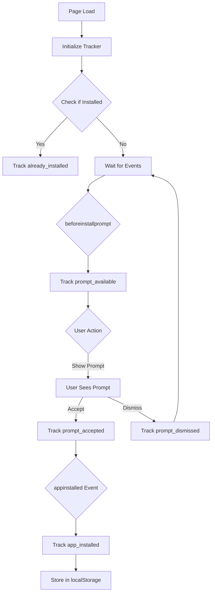

# PWA Install Rate Tracking

## Overview
Comprehensive Progressive Web App (PWA) installation tracking system that monitors user behavior from prompt availability through successful installation.

## Implementation Date
2025-10-11

## Features

### Automatic Event Tracking
The system automatically tracks the following events:

1. **`prompt_available`**: When the browser determines the app is installable
2. **`prompt_accepted`**: User accepts the install prompt
3. **`prompt_dismissed`**: User dismisses the install prompt  
4. **`app_installed`**: App is successfully installed
5. **`already_installed`**: User already has the app installed (one-time check)

### Data Collection
For each event, the system captures:
- User ID (if authenticated, null for anonymous)
- Event type
- Platform (iOS, Android, Windows, macOS, Linux)
- User agent string
- Timestamp

## Database Schema

```sql
CREATE TABLE pwa_analytics (
  id UUID PRIMARY KEY,
  user_id UUID REFERENCES auth.users(id),
  event_type TEXT CHECK (event_type IN ('prompt_available', 'prompt_accepted', 'prompt_dismissed', 'app_installed', 'already_installed')),
  platform TEXT,
  user_agent TEXT,
  timestamp TIMESTAMPTZ DEFAULT now(),
  created_at TIMESTAMPTZ DEFAULT now()
);
```

### Security
- **RLS Enabled**: Row Level Security protects user data
- **Anyone can insert**: Allows tracking before authentication
- **Users view own data**: Users can only see their own analytics
- **Admin access**: Admins (emails ending in @soilsidekick.com) can view all data

## Usage

### In Application Code

The PWA install tracker automatically initializes when the app loads:

```typescript
import { pwaInstallTracker } from '@/services/pwaInstallTracker';

// Check if app is installed
const isInstalled = pwaInstallTracker.isAppInstalled();

// Check if install prompt is available
const canInstall = pwaInstallTracker.isPromptAvailable();

// Show install prompt
const result = await pwaInstallTracker.showInstallPrompt();
// Returns: 'accepted' | 'dismissed' | 'unavailable'
```

### React Hook

```typescript
import { usePWAInstall } from '@/hooks/usePWAInstall';

function MyComponent() {
  const { isInstallable, isInstalled, showInstallPrompt } = usePWAInstall();

  return (
    <>
      {isInstallable && !isInstalled && (
        <button onClick={showInstallPrompt}>
          Install App
        </button>
      )}
      {isInstalled && <p>App is installed!</p>}
    </>
  );
}
```

### Analytics Dashboard

```typescript
import { PWAInstallAnalytics } from '@/components/PWAInstallAnalytics';

function AdminDashboard() {
  return <PWAInstallAnalytics />;
}
```

## Analytics Metrics

The system calculates the following metrics:

### Install Rate
```
Install Rate = (Total Installs / Total Prompts Shown) × 100
```

### Acceptance Rate
```
Acceptance Rate = (Prompts Accepted / (Prompts Accepted + Prompts Dismissed)) × 100
```

### Platform Distribution
Number and percentage of events per platform:
- Android
- iOS  
- Windows
- macOS
- Linux

## API Reference

### `pwaInstallTracker`

**Methods:**

```typescript
// Show install prompt to user
showInstallPrompt(): Promise<'accepted' | 'dismissed' | 'unavailable'>

// Check if app is currently installed
isAppInstalled(): boolean

// Check if install prompt is available
isPromptAvailable(): boolean

// Get analytics data
getInstallAnalytics(startDate?: string, endDate?: string): Promise<Analytics>
```

**Analytics Response:**

```typescript
interface Analytics {
  totalPrompts: number;
  totalAccepted: number;
  totalDismissed: number;
  totalInstalls: number;
  installRate: string; // percentage
  acceptanceRate: string; // percentage
  platformBreakdown: Record<string, number>;
  events: Event[];
}
```

### `usePWAInstall` Hook

**Returns:**

```typescript
{
  isInstallable: boolean;      // Can show install prompt
  isInstalled: boolean;        // App is installed
  showingPrompt: boolean;      // Currently showing prompt
  showInstallPrompt: () => Promise<'accepted' | 'dismissed' | 'unavailable'>;
}
```

## Browser Event Listeners

The tracker listens to these native browser events:

```typescript
// Fired when install criteria are met
window.addEventListener('beforeinstallprompt', handler);

// Fired when app is installed
window.addEventListener('appinstalled', handler);
```

## Platform Detection

The system detects the user's platform from the user agent:

- **Android**: Contains "android"
- **iOS**: Contains "iphone" or "ipad"
- **macOS**: Contains "mac"
- **Windows**: Contains "windows"
- **Linux**: Contains "linux"
- **Unknown**: Doesn't match any pattern

## Installation Detection

The app is considered "installed" if:

1. Running in standalone mode: `(display-mode: standalone)`
2. iOS standalone mode: `navigator.standalone === true`
3. Previously tracked as installed in localStorage

## Tracking Flow



## Analytics Dashboard Features

The PWA Install Analytics component provides:

### Time Range Filters
- Last 7 days
- Last 30 days
- All time
- Custom date ranges

### Key Metrics Cards
1. **Install Rate**: Percentage with progress bar
2. **Acceptance Rate**: User engagement metric
3. **Total Installs**: Absolute number
4. **Total Dismissals**: Opt-out count

### Visualizations

**Conversion Funnel:**
- Bar chart showing: Prompts → Accepted → Installed
- Identifies drop-off points

**Platform Breakdown:**
- Pie chart of platform distribution
- Detailed list with counts per platform

**Event Timeline:**
- Recent events with timestamps
- Event type indicators
- Platform badges

## Data Retention

- Events are stored indefinitely
- No automatic cleanup (for analytics purposes)
- Admins can manually delete old data if needed

## Privacy Considerations

1. **Anonymous Tracking**: Events tracked before login have null user_id
2. **User Consent**: Consider adding privacy policy mention
3. **Data Access**: Users can only see their own data
4. **No PII**: Only platform and user agent collected

## Performance Impact

- **Minimal**: Event listeners are passive
- **Non-blocking**: All tracking is asynchronous
- **Offline-safe**: Events queue until online (if offline storage implemented)

## Testing

### Test Install Flow

1. **Desktop Chrome/Edge:**
   ```
   1. Open app in incognito
   2. Wait for install prompt
   3. Check console: "PWA install prompt available"
   4. Show prompt via UI
   5. Accept/dismiss
   6. Verify event in database
   ```

2. **Mobile Safari:**
   ```
   1. Add to Home Screen manually
   2. Open from home screen
   3. Verify "already_installed" event
   ```

3. **Android Chrome:**
   ```
   1. Open app
   2. Tap "Add to Home Screen"
   3. Confirm installation
   4. Verify events tracked
   ```

### Debugging

```typescript
// Enable debug logging
localStorage.setItem('pwa_debug', 'true');

// Check install status
console.log('Installed:', pwaInstallTracker.isAppInstalled());
console.log('Installable:', pwaInstallTracker.isPromptAvailable());
```

## Common Issues

### Install Prompt Not Showing

**Reasons:**
1. App doesn't meet PWA criteria
   - Missing manifest.json
   - No service worker
   - Not served over HTTPS
2. Already installed
3. User previously dismissed (cooldown period)

**Solutions:**
- Verify manifest.json is valid
- Check service worker registration
- Test in incognito mode
- Clear browser data

### Events Not Tracked

**Reasons:**
1. RLS policy blocking
2. Network error
3. User not authenticated (if policy requires it)

**Solutions:**
- Check browser console for errors
- Verify Supabase connection
- Check RLS policies

### Platform Detection Issues

**Reasons:**
1. Unusual user agent
2. Privacy browser modifying UA

**Solutions:**
- Falls back to "unknown" platform
- Still tracks the event

## Future Enhancements

### Planned Features
- [ ] Cohort analysis (install rates by user segment)
- [ ] A/B testing for install prompts
- [ ] Custom event properties
- [ ] Export analytics to CSV
- [ ] Real-time dashboard updates
- [ ] Install rate benchmarking
- [ ] Funnel optimization suggestions

### Integration Ideas
- Email campaigns when install rate drops
- Push notifications for re-engagement
- Analytics platform integration (GA4, Mixpanel)
- Admin alerts for anomalies

## Resources

- [Web.dev PWA Install Guide](https://web.dev/install-criteria/)
- [MDN beforeinstallprompt](https://developer.mozilla.org/en-US/docs/Web/API/BeforeInstallPromptEvent)
- [PWA Install Patterns](https://web.dev/promote-install/)

## Support

For issues or questions:
1. Check browser console for errors
2. Verify PWA criteria met
3. Test in incognito mode
4. Review RLS policies in Supabase dashboard
