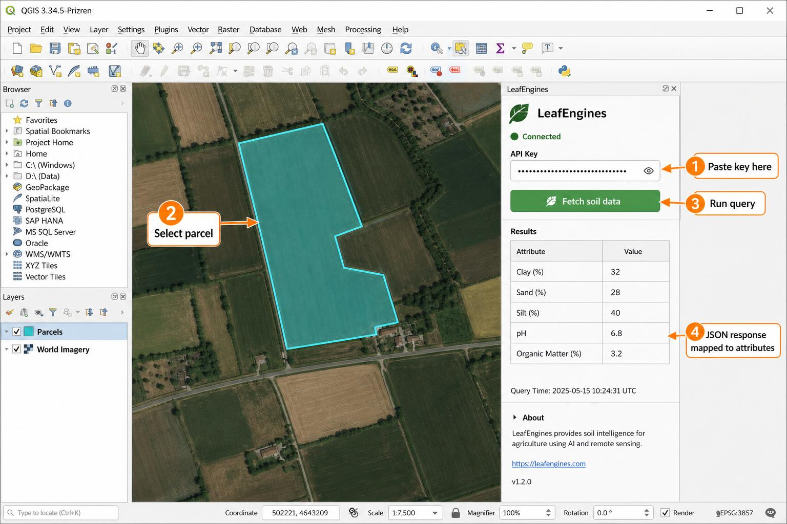

# QGIS + LeafEngines — Developer Landing

> **Audience:** Developers evaluating whether the LeafEngines API fits their stack.
> **Time to first response:** ~60 seconds (no signup, no card).
> **What you'll see on this page:** working query, JSON response schema, Python snippet, annotated QGIS workflow.

---

## TL;DR

- **Free test key:** `leaf-test-370df0a2e62e` — 2 of 20 endpoints unlocked, no signup.
- **Free-tier header alternative:** `x-free-tier: true` (no key required for `get-soil-data`, `county-lookup`, `turboquant-check`).
- **Base URL:** `https://app.soilsidekickpro.com/api` (required `app.` subdomain).
- **Auth header:** `x-api-key: <key>`.

---

## 1. Working Query (curl)

```bash
curl -X GET \
  "https://app.soilsidekickpro.com/api/get-soil-data?fips=48453" \
  -H "x-api-key: leaf-test-370df0a2e62e" \
  -H "Content-Type: application/json"
```

Equivalent free-tier call (no key):

```bash
curl -X GET \
  "https://app.soilsidekickpro.com/api/get-soil-data?fips=48453" \
  -H "x-free-tier: true"
```

---

## 2. JSON Response Structure

Every enterprise-tier response uses the [Data-Quality Envelope](../sdk/DEVELOPER_SPECIFICATIONS.md#7-response-envelope-data-quality-wrapper):

```json
{
  "data": {
    "fips": "48453",
    "county": "Travis",
    "state": "TX",
    "composition": {
      "clay_pct": 32,
      "sand_pct": 28,
      "silt_pct": 40
    },
    "chemistry": {
      "ph": 6.8,
      "organic_matter_pct": 3.2,
      "cec_meq_100g": 18.4
    },
    "hydrology": {
      "drainage_class": "moderately_well_drained",
      "available_water_capacity_cm": 14.2
    },
    "ssurgo_mukey": "3221847"
  },
  "meta": {
    "source": "USDA-SSURGO-2025",
    "freshness_hours": 12,
    "confidence": 0.94,
    "positional_uncertainty_m": 47,
    "request_id": "req_01HZQ8K3X4Y5Z6",
    "cached": true,
    "cache_tier": "L2"
  }
}
```

| Field | Type | Notes |
|---|---|---|
| `data.composition.*_pct` | number | Sums to ~100. Soil texture triangle inputs. |
| `data.chemistry.ph` | number | 0-14. Values <5.5 or >7.5 trigger amendment recommendations. |
| `meta.confidence` | number | 0-1. Values <0.7 SHOULD surface a UI warning. |
| `meta.positional_uncertainty_m` | number | Writes >500 m are blocked at the DB layer (see [core memory](../architecture/TECHNICAL_DESIGN.md)). |
| `meta.cache_tier` | string | `L1`\|`L2`\|`L3`\|`L4` — hierarchical KV cache hit tier. |

Error envelope follows [DEVELOPER_SPECIFICATIONS §8](../sdk/DEVELOPER_SPECIFICATIONS.md#8-error-model).

---

## 3. Python Integration Snippet

Minimal, dependency-light — uses `requests`. Works in any Python 3.9+ environment (scripts, notebooks, or the QGIS Python console).

```python
import os
import requests

BASE_URL = "https://app.soilsidekickpro.com/api"
API_KEY = os.environ.get("LEAFENGINES_API_KEY", "leaf-test-370df0a2e62e")

def get_soil(fips: str) -> dict:
    """Fetch SSURGO-backed soil composition for a US county FIPS code."""
    resp = requests.get(
        f"{BASE_URL}/get-soil-data",
        params={"fips": fips},
        headers={
            "x-api-key": API_KEY,
            "Content-Type": "application/json",
        },
        timeout=10,
    )
    resp.raise_for_status()
    return resp.json()

if __name__ == "__main__":
    result = get_soil("48453")  # Travis County, TX
    d = result["data"]
    m = result["meta"]
    print(f"{d['county']}, {d['state']}: pH {d['chemistry']['ph']} "
          f"(confidence {m['confidence']}, cache {m['cache_tier']})")
```

For the typed SDK client, install `pip install soilsidekick` and see [DEVELOPER_SPECIFICATIONS §4](../sdk/DEVELOPER_SPECIFICATIONS.md#4-configuration).

---

## 4. Annotated QGIS Workflow

The LeafEngines QGIS plugin wraps the same endpoint. The four numbered callouts below map 1:1 to the code snippet above:



| Callout | Action | Equivalent in code |
|---|---|---|
| **1 — Paste key here** | API key field in the LeafEngines panel | `x-api-key` header |
| **2 — Select parcel** | Any vector feature with valid geometry on the canvas | `fips` (or `lat`/`lon`) query param |
| **3 — Run query** | Click **Fetch soil data** | `requests.get(...)` |
| **4 — JSON response mapped to attributes** | Response fields written back as `le_*` columns on the layer | `result["data"]` fields |

Every field in the JSON response becomes an `le_*` attribute (`le_clay_pct`, `le_ph`, `le_confidence`, `le_cache_tier`, …), which means QGIS styling, expressions, and Processing models can consume LeafEngines data with no glue code.

---

## 5. Next Steps

- **Full SDK contracts:** [DEVELOPER_SPECIFICATIONS.md](../sdk/DEVELOPER_SPECIFICATIONS.md)
- **QGIS plugin deep dive:** [12_QGIS_SDK_DEEP_DIVE.md](./12_QGIS_SDK_DEEP_DIVE.md)
- **QGIS implementation guide:** [13_QGIS_IMPLEMENTATION_GUIDE.md](./13_QGIS_IMPLEMENTATION_GUIDE.md)
- **API reference:** [API_DOCUMENTATION.md](../api/API_DOCUMENTATION.md)
- **Get a production key:** [/api-keys](https://app.soilsidekickpro.com/api-keys)

### SoilCertify GIS Companion Docs

Consultant- and evaluator-facing companion pages that reuse the same API surface under the SoilCertify brand:

- **[Technical Overview](./soilcertify/TECHNICAL_OVERVIEW.md)** — data sources, scoring methodology, confidence logic, endpoints, latency SLAs.
- **[Developer Reference](./soilcertify/DEVELOPER_LANDING.md)** — working curl, JSON schema, Python `requests` snippet, annotated QGIS WFS workflow.
- **[Infrastructure Use Case](./soilcertify/INFRASTRUCTURE_USE_CASE.md)** — GIS consultancy 120-parcel screening walkthrough with before/after ROI.


---

*LeafEngines™ | SoilSidekick Pro® | Space gives the picture. We give the truth.*
